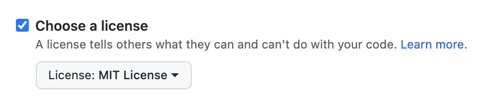

# Fullstack project

Write a web server, which delivers jokes as json data. The React frontend displays the jokes.

Create one folder for the backend and one folder for the frontend track the changes for each of them in a separate GitHub repository. When creating the repository with GitHub, add the MIT License to your project, as the library you will be using has the same licence: https://github.com/elijahmanor/devpun/blob/master/LICENSE



## Backend with Node.js + Express

Write an [express](https://expressjs.com/) web server with the following routes:

```bash
GET /random # returns a random joke

GET /by-category?name=react # returns all react jokes

GET /search?text=component # returns all jokes which contain "component" in the text (should be case-insensitive)

(optional)
GET /categories # returns all joke categories

(optional)
GET /popular # returns the 5 most popular jokes
```

The question mark in the urls are [query parameters](https://branch.io/glossary/query-parameters/). See this article about [Query Parameters in Express](https://masteringjs.io/tutorials/express/query-parameters) how you can read them when handling the request.

Use the [devpun](https://www.npmjs.com/package/devpun) library to get the jokes. However, this library does not provide all the functionality you need. For example, it does not provide you a method to get the most popular jokes. Check the library on GitHub and find out how to implement this functionality with your own code (without changing the library itself).

In order to have the backend application on one domain and the frontend application on another, [allow CORS requests](https://expressjs.com/en/resources/middleware/cors.html) for localhost and your frontend domain when published on Netlify.<br />
[More about CORS](https://www.youtube.com/watch?v=4KHiSt0oLJ0)

```js
app.use(
  cors({
    origin: ['http://localhost:3000', '<deployed URL>'],
  })
);
```

Deploy the server on [Heroku](https://www.heroku.com/).

_Hint: How to remove duplicate values (for /categories)_

```js
const numbers = Array.from(new Set([1, 1, 2, 3, 3]));
// numbers is [1, 2, 3]
```

## Frontend with React

Create a react application with the following pages:

- Random joke
- Jokes by category
- Joke search
- 404 / not found (optional)
- Popular jokes (optional)

Create the GitHub repository first (see licence information above), clone the repository and create the react application directly within the cloned folder:

```
npx create-react-app .
```

Use your backend to get the data. It always arrives in the following format:

```json
"q. <question text> a. <answer text>"
```

Here's the code how you can split the text into question and answer:

```js
const questionChars = 'q. ';
const answerChars = 'a. ';
const question = joke.substring(questionChars.length, joke.indexOf(answerChars) - 1);
const answer = joke.substring(joke.indexOf(answerChars) + answerChars.length);
```

### Randome joke page

- Route: `/random`
- This is the homepage. When the user opens the page with route `/`, redirect the user to this page.
- Display a random joke on the page.

### Jokes by category page

- Route: `/by-category`
- Display a button for each category. Either hardcode the categories as array in your frontend application (see [list of all the tags](https://github.com/elijahmanor/devpun#tags)) or you load the categories from your backend with `GET /categories`.
- After clicking a category button, load the jokes and display them on the page.

### Joke search page

- Route: `/search`
- Display a search field and a submit button. After submitting, load the jokes and display them on the page.
- Inform the user when no joke was found.

### 404 / not found page

- Route: any route, which does not lead to a page.
- Display a nice message to the user that the requested page does not exist.

### Popular jokes page (optional)

- Route: `/popular`
- Load the most popular jokes and display them on the page.

Deploy the application to [Netlify](https://www.netlify.com/).
